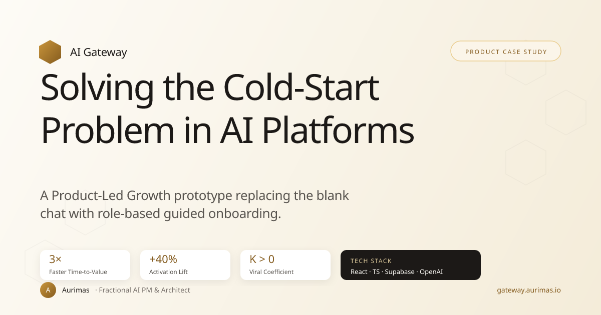

# AI Gateway: PLG Onboarding PoC



> A **Product-Led Growth** prototype that solves the **Cold-Start Problem** in AI platforms — replacing the blank chat interface with a role-based guided setup that drives activation, retention, and viral expansion.

**[Live Demo](https://gateway.aurimas.io)** &nbsp;|&nbsp; **[Workspace](https://gateway.aurimas.io/workspace)** &nbsp;|&nbsp; **[Agents](https://gateway.aurimas.io/agents)** &nbsp;|&nbsp; **[Pricing](https://gateway.aurimas.io/pricing)** &nbsp;|&nbsp; **[Case Study](https://gateway.aurimas.io/case-study)** &nbsp;|&nbsp; **[Metrics](https://gateway.aurimas.io/metrics)** &nbsp;|&nbsp; **[Changelog](https://gateway.aurimas.io/changelog)**

---

## Overview

Most AI platforms drop new users into an empty chat window and hope they figure it out. The result: **high churn, low activation, zero virality.**

**AI Gateway** takes a different approach. Instead of a blank slate, users go through a **role-based guided onboarding flow** that personalizes their experience from the first click — reducing **Time-to-Value (TtV)** and creating natural expansion moments.

This project is a fully functional **proof-of-concept** demonstrating three core PLG growth levers, built end-to-end with production-grade tooling.

---

## Core Growth Features

### 1. Role-Based Activation

- Users select their role (**Marketing**, **Developers**, **Legal**, **HR**) immediately after signup
- The app dynamically renders a **curated AI agent library** tailored to their function
- **Premium "PRO" templates** with a paywall gate demonstrate monetization hooks
- **Why it matters:** Personalization at signup reduces TtV from minutes to seconds

### 2. B2B Viral Expansion Loop

- A frictionless **"Invite your Team"** modal is embedded directly into the **"Aha!" moment** — right after workspace creation
- Invite tracking is persisted to the database with the teammate's email
- The flow is designed to feel natural, not forced — with a clear skip path
- **Why it matters:** Embeds virality into the product experience itself, driving **K-Factor > 0**

### 3. Funnel Analytics & A/B Testing

- A hidden **`/metrics`** dashboard tracks the full acquisition funnel in real time:
  - **Signup Views** → **Roles Selected** → **Templates Clicked** → **Team Invites Sent**
- Calculates **Conversion Rate** and **Viral Rate (K-Factor)** automatically
- Includes a **Simulate A/B Test** toggle on the signup screen:
  - **Variant B (Guided):** Full role-based onboarding flow
  - **Variant A (Control):** Skips directly to a blank chat interface
- All events (including `paywall_viewed` and `upgrade_intent_clicked`) are tracked in Supabase
- **Why it matters:** Gives PMs and growth teams the data to prove guided onboarding outperforms blank-slate experiences

### 4. Working Chat Workspace (`/workspace`)

- **Streaming chat UI** with conversation history, agent picker, and per-agent suggestion prompts
- **Hybrid AI backend:**
  - **Real GPT-4o-mini** when `OPENAI_API_KEY` is set as a Vercel environment variable (server-side only — never exposed to the browser)
  - **Deterministic mock** with realistic token streaming when no key is configured
- Conversations persisted to `localStorage` (capped at 50)
- Per-agent system prompts tuned for each of the 16 agents
- **Why it matters:** Demonstrates the actual product surface, not just the marketing flow

### 5. Agent Catalog (`/agents`), Pricing (`/pricing`), Settings (`/settings`), Changelog (`/changelog`)

- **Agent Catalog** — searchable, filterable browse view of all 16 agents
- **Pricing** — 4 tiers (Free / Pro / Team / Enterprise) with FAQ and trust signals
- **Settings** — workspace name, team invites, API key docs, usage stats, danger zone
- **Changelog** — versioned release notes signaling product velocity

---

## Tech Stack

| Layer | Technology |
|---|---|
| **Frontend** | React + TypeScript + Vite |
| **Styling** | Tailwind CSS |
| **Icons** | Lucide React |
| **AI / LLM** | OpenAI GPT API |
| **Backend / Analytics** | Supabase (PostgreSQL + REST API) |
| **Hosting** | Vercel (auto-deploys on push to `main`) |
| **Routing** | React Router DOM |

---

## Getting Started

### 1. Install dependencies

```bash
npm install
```

### 2. Configure Supabase

Create a `.env.local` file in the project root with your Supabase credentials:

```env
VITE_SUPABASE_URL=https://your-project.supabase.co
VITE_SUPABASE_ANON_KEY=your-anon-key
```

> **Note:** The app runs fully without Supabase — analytics simply won't persist. No setup required for local development.

### 3. Start the dev server

```bash
npm run dev
```

The app will be available at **http://localhost:5173**.

---

## Project Structure

```
src/
├── components/
│   ├── EmailSignup.tsx        # Step 1: Email capture + A/B toggle
│   ├── RoleSelector.tsx       # Step 2: Role-based personalization
│   ├── TemplateLibrary.tsx    # Step 3: Agent selection + PRO paywall
│   ├── SuccessModal.tsx       # Team invite modal (viral loop)
│   ├── PaywallModal.tsx       # Premium upgrade gate
│   ├── MetricsDashboard.tsx   # Hidden /metrics analytics
│   ├── OnboardingLayout.tsx   # Shared layout + step indicator
│   └── StepIndicator.tsx      # Progress dots
├── data/
│   └── templates.ts           # Role → Template mapping
├── lib/
│   ├── analytics.ts           # Supabase event tracking
│   └── supabase.ts            # Client init + graceful fallback
├── types/
│   └── onboarding.ts          # TypeScript interfaces
├── App.tsx                    # Flow orchestrator
└── main.tsx                   # Router setup
```

---

## Key PM Decisions

- **Guided > Blank:** A/B test infrastructure proves that structured onboarding outperforms an empty interface
- **Virality at the Aha Moment:** Team invites are triggered at peak engagement, not buried in settings
- **Paywall as Signal:** PRO badges create perceived value and generate `upgrade_intent_clicked` data for pricing validation
- **Metrics-First:** Every interaction is instrumented — PMs can measure impact before writing a single PRD
